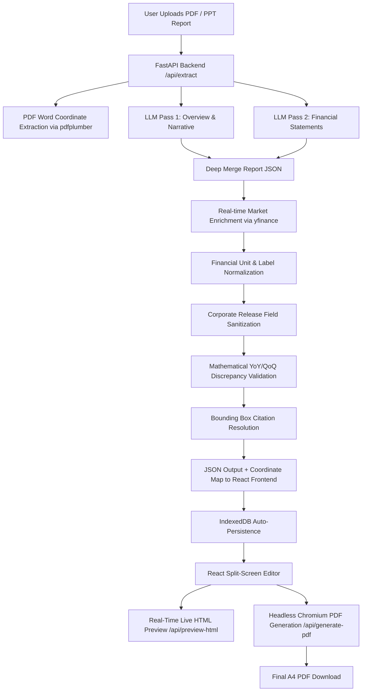

# FinReport AI — Financial Report Extraction and Compiler

<video src="https://github.com/Lopezzz56/bull_afrg/raw/main/demo.mp4" width="100%" controls autoplay loop muted>
  Your browser does not support the video tag.
</video>

FinReport AI is an end-to-end automated platform that converts raw brokerage research reports and earnings releases into standardized, structured equity research documents. It extracts structured financial statements, unstructured narrative summaries, calculates visual chart metrics, resolves exact bounding-box page citations, and generates print-ready A4 PDF reports mirroring professional institutional layouts.

---

## Key Features

### 1. Recreated Fillable PDF Template
* Recreated standard institutional brokerage layouts (such as Geojit equity research reports) as a fillable Jinja2 HTML/CSS template (`geojit_template.html`).
* Preserves exact page boundaries, typography, multi-column layouts, financial data tables, shareholding breakdown, rating criteria, and analyst disclosures.

### 2. Dual-Pass AI Data Extraction
* Utilizes a concurrent two-pass extraction pipeline powered by Gemini 2.0 Flash with an automated fallback cascade via OpenRouter.
* **Pass 1 (Overview & Narrative)**: Extracts header metadata (Company Name, Ticker, Target Price, Rating), investment highlights, key summary bullets, and analyst disclosure information.
* **Pass 2 (Financial Statements)**: Extracts multi-period structured financial tables including Profit & Loss, Balance Sheet, Cash Flow Statement, Financial Ratios, and Quarterly Results.

> **Why Two-Pass Extraction?**  
> Large Language Models (especially open/lightweight MoE models like `Gemma-4-26B` or free tier endpoints) enforce strict completion token limits (typically capped at 2,048 output tokens). Attempting to extract 80+ distinct keys and multi-year financial statements in a single prompt call leads to response truncation and dropped tables. 
> 
> Splitting the schema into two concurrent requests halves output token load per request, eliminates attention dilution, and allows lightweight models to match the extraction precision of flagship models like `Gemini 2.5 Pro`.


### 3. Coordinate Citation Resolution
* Integrated word-level coordinate parser (`pdfplumber`) that maps extracted numerical metrics back to their original page coordinates.
* Interactive UI highlighting: Selecting any field in the editor highlights the exact bounding box (`[x0, top, x1, bottom]`) on the source PDF document.

### 4. Real-Time Market Data Enrichment
* Automatic integration with `yfinance` to query real-time stock market data.
* Enriches reports with live Current Market Price (CMP), Market Capitalization (in Cr.), Outstanding Shares, and 52-Week High/Low bounds based on the company's NSE ticker.

### 5. Dual-Layer Math Validation Engine
* Automatically verifies reported Year-over-Year (YoY%) and Quarter-over-Quarter (QoQ%) growth percentages against calculated values.
* Flags discrepancies exceeding 1.0% with visual warnings in both backend response payloads and client-side editor fields.

### 6. High-Fidelity PDF Generation
* Uses headless Chromium via Playwright to render the Jinja2 HTML template into a pixel-perfect A4 PDF.
* Embeds dynamically rendered SVG/base64 charts for financial performance trends.

### 7. Interactive Split-Screen UI
* Built with React 19, Vite, and Tailwind CSS.
* Features a split-screen view with a source document viewer on the left and a multi-tab editor/live HTML preview on the right.
* Supports both standard portrait A4 PDFs and landscape presentation slides (PPTs/mixed-size pages) with responsive aspect-ratio rendering.
* Browser-native IndexedDB state retention preserving uploaded files and active edits across page reloads.

---

## Technical Architecture & Pipeline



### System Processing Workflow

1. **Document Ingestion & Parsing**: The backend receives the document payload, extracts full text content, and indexes word bounding boxes with exact page numbers.
2. **Concurrent LLM Extraction**: The system initiates concurrent Pass 1 (Metadata & Narratives) and Pass 2 (Financial Tables) extraction calls to maximize speed and extraction quality.
3. **Data Merging & Sanitization**: JSON outputs are merged using a recursive dictionary merger. Document-type sanitization automatically differentiates official corporate press releases from broker research notes.
4. **Market & Math Enrichment**: Live market metrics (CMP, Market Cap) are fetched via `yfinance`. Mathematical verification runs against all historical and quarterly financial rows.
5. **Interactive Editing & Persistence**: The extracted data is dispatched to the React frontend and persisted in IndexedDB. Users can edit any text or number with instant live preview updating.
6. **PDF Compilation**: Upon clicking download, the backend compiles the Jinja2 template with Matplotlib/SVG chart assets and invokes Playwright Chromium to print a print-quality A4 PDF.

---

## Repository Structure

```
bull_afrg/
├── backend/
│   ├── main.py                  FastAPI server endpoints
│   ├── geojit_template.html     Fillable A4 HTML/CSS Jinja2 template
│   ├── app/
│   │   ├── core/config.py       Environment configuration
│   │   ├── schemas.py           Pydantic response models
│   │   └── services/
│   │       ├── extractor.py     Two-pass LLM extraction & pipeline orchestration
│   │       ├── parser.py        pdfplumber word coordinate parser
│   │       ├── validator.py     YoY / QoQ mathematical consistency engine
│   │       ├── charts.py        Matplotlib financial chart generator
│   │       └── pdf_generator.py Jinja2 compilation & Playwright PDF renderer
│   └── requirements.txt
├── frontend/
│   ├── src/
│   │   ├── App.jsx              Main application component & state manager
│   │   ├── components/
│   │   │   ├── Header.jsx       Header component
│   │   │   ├── FileDropzone.jsx File drag-and-drop handler
│   │   │   ├── PdfHighlightOverlay.jsx Responsive PDF canvas viewer with highlights
│   │   │   └── EditablePreviewModal.jsx Tabbed editor & live preview panel
│   │   └── services/
│   │       ├── api.js           Backend REST API client
│   │       └── db.js            IndexedDB state persistence manager
│   ├── package.json
│   └── vite.config.js
├── README.md
└── demo.mp4                      Demonstration video file
```

---

## Local Setup Instructions

### Prerequisites
* Python 3.11 or higher
* Node.js 18 or higher
* npm or yarn

### 1. Clone the Repository

```bash
git clone https://github.com/Lopezzz56/bull_afrg.git
cd bull_afrg
```

### 2. Backend Setup

```powershell
# Navigate to backend directory
cd backend

# Create and activate a virtual environment
python -m venv ..\venv
..\venv\Scripts\Activate.ps1

# Install Python dependencies
pip install -r requirements.txt

# Install Playwright Chromium browser for PDF rendering
playwright install chromium
```

#### Backend Environment Configuration
Create or modify `.env` in the `backend/` directory:

```env
GEMINI_API_KEY=your_gemini_api_key_here
GEMINI_MODEL=gemini-2.5-pro

OPENROUTER_API_KEY=your_openrouter_api_key_here  # Optional fallback
OPENROUTER_MODEL=google/gemma-4-31b-it:free
OPENROUTER_FALLBACK_MODEL=google/gemma-4-26b-a4b-it:free

TEMPLATE_NAME=geojit_template.html
```

#### Run Backend Server

```powershell
# Run from project root directory
uvicorn backend.main:app --reload --port 8000
```
The backend API will run at `http://127.0.0.1:8000`.

### 3. Frontend Setup

Open a new terminal window and navigate to the frontend directory:

```powershell
cd frontend

# Install Node dependencies
npm install

# Start Vite development server
npm run dev
```
The frontend application will be available at `http://localhost:5173`.

---

## API Reference

| Method | Endpoint | Description |
| :--- | :--- | :--- |
| `POST` | `/api/extract` | Uploads PDF/PPT document, extracts structured financial data, and resolves bounding boxes |
| `POST` | `/api/preview-html` | Generates rendered HTML string with embedded SVG charts for live editor preview |
| `POST` | `/api/generate-pdf` | Compiles Jinja2 template and renders final downloadable A4 PDF via Playwright |
| `GET` | `/api/mock-pdf` | Returns default ICICI Q2FY26 demo PDF file for instant demonstration |

---

## Ongoing Improvements

* Enhancing template styling and layout responsiveness for broader institutional report styles.
* Expanding extraction schema coverage to capture deeper sub-segmental revenue breakdowns and balance sheet line items.
